# RunPod Setup Instructions

# Step 1. Steps before Deploying

For developing on [runpod.io](https://runpod.io), you will want to be able to SSH in to from your own laptop/device. To enable this, the most reliable way to be able to `ssh` without further hassle is to ensure created pods recognize your device. Here's how:

0. Ask a team member for access to the Runpod workspace (and create account if you havent already)

1. Generate an SSH key on your local machine if you don't already have one:

```bash
ssh-keygen -t ed25519 -C "your_email@example.com"
```

   Accept the default file location (`~/.ssh/id_ed25519`) by pressing Enter. Optionally set a passphrase.

2. Print your public key so you can copy it:

```bash
cat ~/.ssh/id_ed25519.pub
```

   Copy the full output for the next step.

3. Looking at the bar left to the homepage, navigate to "My templates" and click "Edit Template" on "Humanoid-dev-GUI":

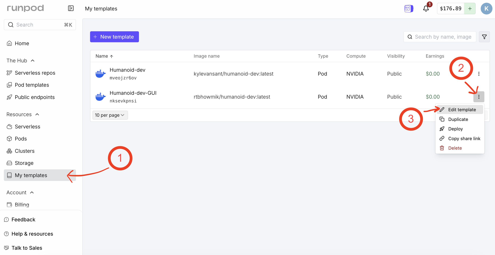

Next, scroll down and expand the "Environment Variables" tab and open the "Raw Editor"

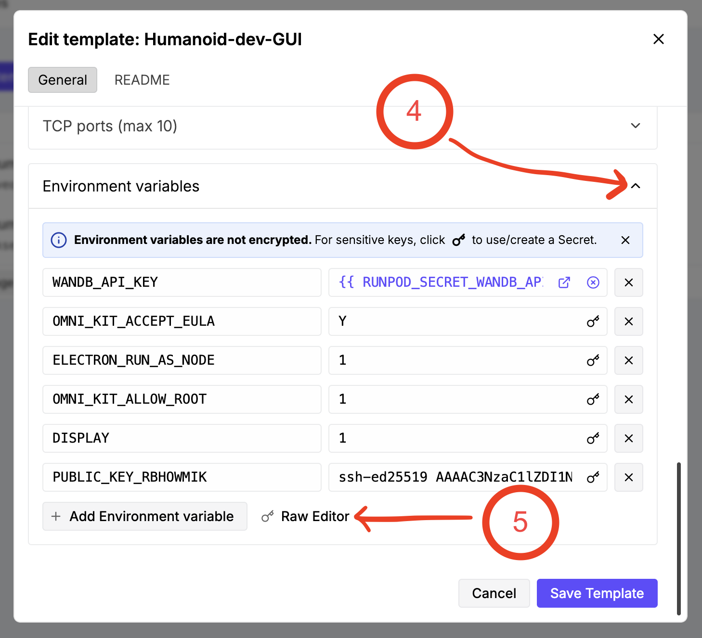

Here, you can paste in your copied public key in the raw editor as shown. Specifically, your environment variable name should start with `PUBLIC_KEY_` to be valid. Make sure to properly "Update Variables" and "Save Template".


If you're curious, the container start command reads through all environment variables with names of the form `PUBLIC_KEY_{.*}` and writes them into `~/.ssh/authorized_keys`, which is what allows your machine to SSH in without a password.

# Step 2. Deploying a Runpod

1. Set up a pod on [runpod.io](https://runpod.io). Deploy using the **Humanoid-Dev-GUI** template. These images tell you how:

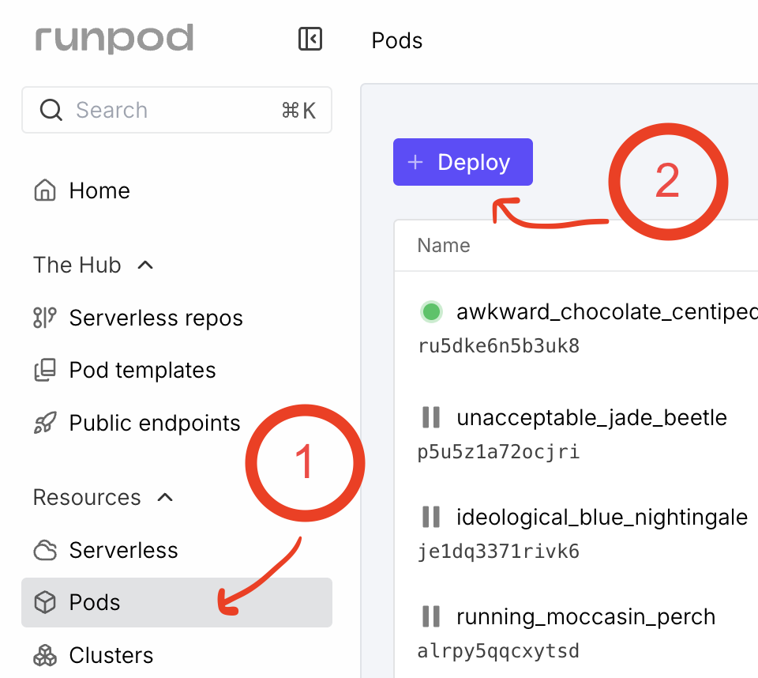

For GPU selection, NVIDIA RTX 4090 (cheaper) and 5090 (slightly more powerful) are good choices for development while H100/200 SXMs (pretty powerful) are better for serious final-draft training/deployment.

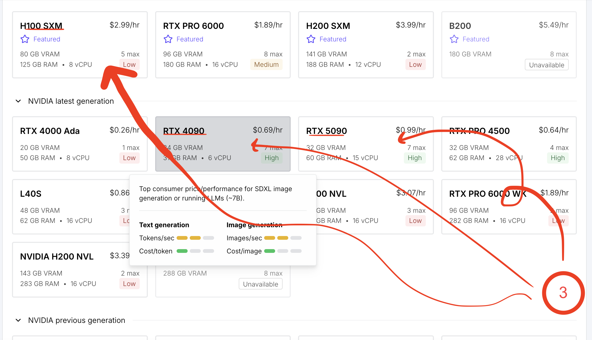

Now you can select a pod name (e.g. include your name for ownership, lest it get stopped!), switch the template to `Humanoid-dev-GUI`, and GPU count (development only needs 1 usually, final training/deployment can use more if necessary).

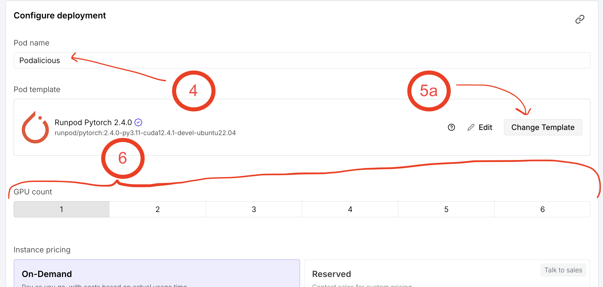

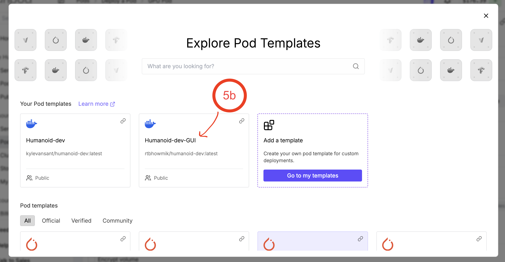


Finally, choose a memory mode. *This step will be elaborated later.* For now, choose "Volume Disk" for temporary storage to select how much to allocate for the pod; this is temporary storage that will be destroyed on termination. Best practices are to make edits sparingly on the pod, and when you do immediately save them in the cloud (usually GitHub, `git push`). Now deploy!

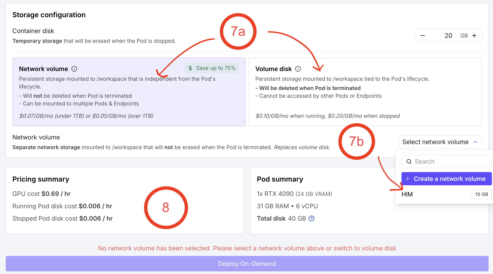


2. You can now set up a remote interactive GUI window to visualize simulations and more. Once the pod is running,  open an interactive web terminal:

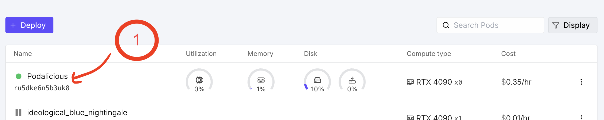

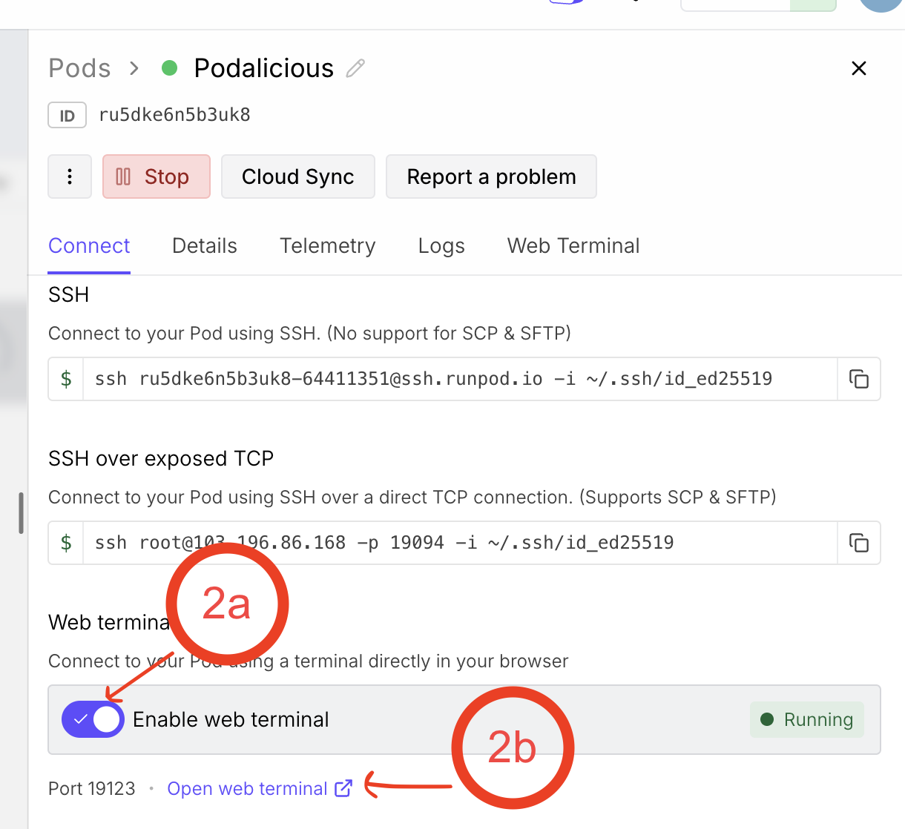

Paste the following and run it in the new web terminal:

```bash
# Set the VNC password non-interactively.
# The four fields are: password, confirm password, view-only password (blank = skip), confirm (blank = skip).
# Change "123123" to something stronger if this pod is long-lived or shared.
echo -e "123123\n123123\n\n" | vncpasswd

# Start a VNC server at display :1 with 1080p resolution.
vncserver :1 -geometry 1920x1080 -depth 24

# Bridge the VNC port to a web-accessible websocket so you can connect via browser.
websockify --web=/usr/share/novnc 5999 localhost:5901 &
```

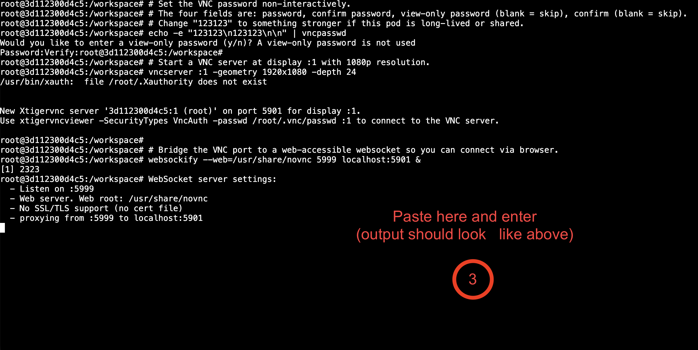

Keep this window open for as long as you want an interactive GUI. You close it, it terminates the session.

3. Now visit the pod's port **5999**, then open the URL and click **`vnc.html`**.

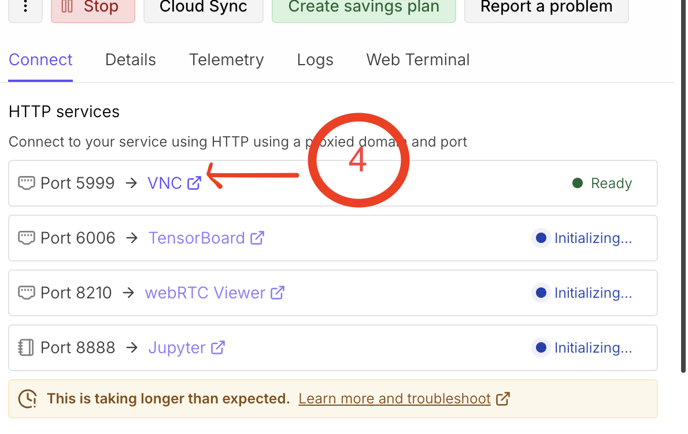
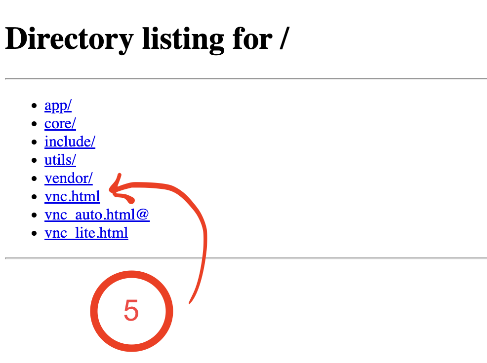
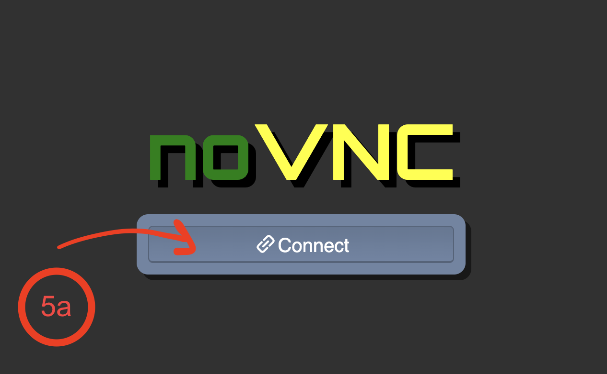

The default password should be simple and rememberable: `123123`

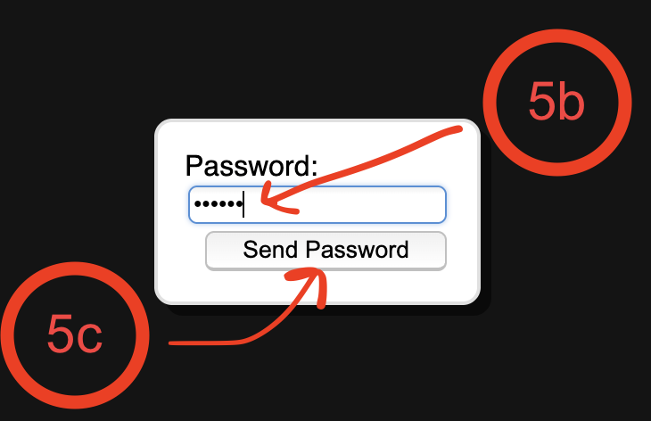

---

## Smoke Tests

A good first check is launching `isaacsim` in the VNC terminal to confirm the GUI and GPU are working.

~~You can also run a random agent on the cartpole balancing task to verify that physics simulation and 3D geometry load correctly:~~ Not really working right now, TODO

```bash
/usr/bin/python3 scripts/environments/random_agent.py \
  --task Isaac-Cartpole-Direct-v0 \
  --num_envs 128
```~~


Enjoy!
